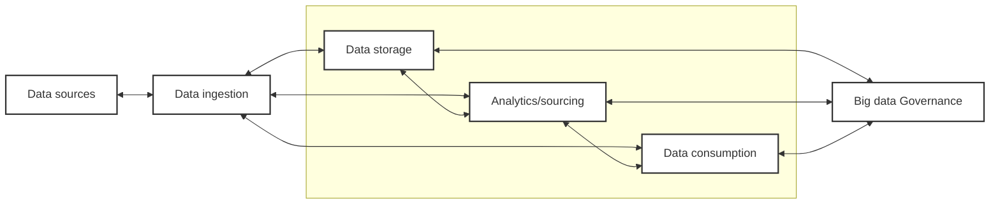

# IN411- Big Data - Summary

Special thanks to [@haninekhalil](https://github.com/haninekhalil) for writing the physical version of the summary, which this document is based on.

## Chapter 1- Overview of Big Data

Big data is a collection of data sets so large, fast, and complex.
Impossible to process them with the traditional data processing systems and usual databases and tools.
A big data can be:
- **Unstructured**, no predefined structure.
- **Semi-structured**, doesn't fit into tables but still has some organizational properties.
- **Structured**, highly organized and stored in fixed format.

### Characteristics of Big Data

- **Volume**: The amount of data generated and stored.
- **Velocity**: The speed at which data is generated and processed.
- **Variety**: The different types of data (text, images, videos, etc.).
- **Veracity**: The quality and accuracy of the data.
- **Value**: The usefulness of the data for decision-making.

> Higher veracity = higher value

### Advantages of Big Data

- Enhanced decision-making capabilities.
- Increaased efficiency and productivity.
- Enhanced customer insights.
- Cost effectiveness.

### Challenges in Big Data

- Technical Challenges:
  - Scalability
  - Storage management
  - Real-time processing
  - System reliability

- Data challenges:
  - Quality & Cleaning
  - Integration from multiple sources

- Privacy and Security Challenges:
  - Data breaches
  - Encryption
  - Compliance (GDPR)

- Ethical Challenges:
  - Bias in data
  - Data ownership

### Big Data Architecture

#### Data sources

From where we get the data, we have 3 types of data sources:

- **Structured data**: from relationel db and tables (sql, oracle, db, ...)
- **Semi-structured data**: from json, xml, csv, ...
- **Unstructured data**: from social media, images, videos, audio, ...

#### Data Ingestion

Importing and loading data either **batch and scheduled** *(collect now, process later)* or **real-time modes** *(process immediately as data arrives)*.

- **Batch/Scheduled:**
    - Data collected over time and then ingest in large chunks at scheduled intervals.
    - Cost Friendly, handle large data, scheduled, higher latency.
    - Examples: Apache Sqoop, Apache NiFi, ETL tools.
- **Real-time/Stream/In-memory:** 
    - Data is ingested immediately as it is generated, continuous flow of data into the system.
    - Low latency, continuous, more complex, costlier, resource intensive.
    - Examples: Apache Kafka, Apache Flink, Apache Spark Streaming.

#### Data Storage

Where the data ingested are being stored and transformed so it can easily be analyzed and used for insights.
It stores all the types of data, stored in many machines, distributed file systems are used *(e.g., Hadoop Distributed File System - HDFS)*. 

Once stored, the data is processed and transformed *(cleaning, filtering, and aggregation)*. It can be done in batch or real-time. Distributed processing allows tasks to **run in parallel**.

#### Transformation Processes

1. **Data cleaning:** removes or correcting inaccurate data *(duplicates, missing values, incorrect format, etc.)*.
2. **Data enrichment:** enhance the original dataset by adding extra information or context to make it meaningful and valuable.
3. **Normalization:** convert data into standardized and consistent format.
4. **Structuring:** transforms semi- and unstructured data into structured ones.

#### Analytics and servicing

Dedicated to data exploration enabling various activities *(discovering, ML, predictive modeling, etc.)*, that provide a secure space for users to experiment with and analyze data without impacting the integrity of data infrastructure.

#### Data Consumption

Provide insights, solutionsm and reporting, data visualization, alerting, search, etc...

#### Big Data Governance

Work on all the other layer to provide security and monitoring, defines policies, roles, ... to ensure consistency in information and responsibility *(r.g. Apache Atlas)*

#### Big Data Tools

<!-- TODO: Check PDF for content -->

## Chapter 2- Hadoop Rcosystem

Hadoop in an open source, distributed storage system, distributed processing system, fault tolerant, works on commodity hardware (cheap pc).
It allows storing massive data and procesing it, runing jobs in parallel.

### Core Design Principle

- **Data locality:** Data are stored across multiple nodes, Hadoop sends the processing tasks to the nodes where the data is stored.
- **Horizontal Scaling:** Adding more machines to the cluster
- **Fault Tolerance:** expects machines to fails so it *replicates data*, and *automatically recovers*.
- **Batch Processing:** Jobs are queued and processed in batches, not real-time.
- **Write Once, Read Many:** Data is written once and can be read multiple times, in HDFS, data is immutable, cannot be modified or deleted.
- **Resources Sharing:** Multiple applications can share the same resources in the cluster.
- **File System:** HDFS is a distributed file system that stores data across multiple nodes in the cluster, providing high throughput access to data.
- **Commodity Hardware:** Hadoop is designed to run on low-cost, commodity hardware, making it cost-effective for organizations to store and process large amounts of data.

### Hadoop Architecture

- **HDFS** *(Hadoop Distributed File System):*
  - Stores big data files
  - Splits them into blocks
  - Distributes them across machines
- **YARN** *(Yet Another Resource Negotiator):*
  - Manages resources *(cpu, memory, disk, ...)* and scheduling of jobs
  - Allocates resources to different applications running on the cluster
- **MapReduce:**
  - A programming model for processing large data sets in parallel across a Hadoop cluster
  - Consists of two main phases: Map and Reduce
  - Map phase processes input data and generates intermediate key-value pairs
  - Reduce phase aggregates the intermediate results and produces the final output

### Advantages of Hadoop

- Supports use of inexpensive commodity hardware, it runs on normal cheap computers.
- No **RAID** *(Redunded array of independat disks)* needed, HDFS already replicates data by default to 3 copies
- Provides simple, massive parallelism, reslience by replicating datam locality of execution, as it knows wher data is placed.
- **Software is free**: it is open-source
- High quality support and training available at modest coast.

### Security in Hadoop ecosystem

- **Authentication:** Kerberos-based auth
- **Authorization:** Apache Ranger, Apache Sentry
- **Data protection:** HDFS encryption, audit logging, TLS

### Hadoop deployment models

- On-premises Clusters
- Cloud-based Hadoop *(Amazon EMR, Google Cloud Dataproc, Microsoft Azure HDInsight)*
- Hybrid Architecture

### HDFS (Hadoop Distributed File System)

- Storage System to share **very large datasets**, accross clusters by *splitting them into blocks*. **Scalable**, **fault tolerant**, optimized for **high throughput batch access**.
- **Name-Node** *(Master node)*: automatically stores and replicates the data (3 times) accross the various **Data-Nodes** *(Slave nodes, where the data is actually stored)*. It also manages the metadata of the files and directories in the file system.

### MapReduce (Programming Model)

It's a processing phase for Big Data.

MapReduce enables parallel processing by partitioning vast datasets into smaller segments, processing them concurrently across hadoop then it consolidates (merge) the results from multiple servers to deliver a unified output to the app.

Hadoop works in 2 main steps:

#### Map Phase

- Split the data into blocks
- Assign each block to an instance
- Run these instances in parallel
- Prodouce key-value pairs

#### Reduce Phase

After all the instances finishes all their sub-tasks, they sends their results, then merge them to obtain the final result (takes all values that shares the same key, combines them or aggregates them).

#### Some MapReduce Definitions

- **Input split:** Take the huge file and splits it into manageable chunks *(usually 64/128 MB)*.
- **Record Reoder:** Define a slice of work but doesn't describe how to access it, and convert the data into key-value pairs for mappers to read.
- **Mapper:** They work in parllel, each for a part of the data, it takes k-V pairs and generate one or more K-V pairs.
- **Partitioner:** Assigns each key to a specific reducer.
- **Reducer:** Get a single key with all it's values, and process them to produce the final output.
- **Output format:** gets the final K-V pairs and write them in HDFS.

## Chapter 3- Apache Spark

- Apache Spark is a tool to access big data fast
- It keeps the data in the main memory (RAM) instead of disk
- Spark can do map, reduce, join, sample, etc...

### Spark Components

#### Spark Core

Basic engine that has the basic functionalities:
- Task scheduling
- Memory management
- Fault recovery

Provides the APIs that are used to create RDDs and applies transformations and actions on them

#### Spark Schedulers

Spark can explout many schedulers to execute its applications
- Hadoop YARN
- Apache Mesos
- Standalone cluster manager

#### Spark SQL structured data

It interact with structured datasets by sql or querying APIs

#### MLLib

Machine Learning and data mining library, it can be used to apply the parallel versions of some machine learning and data mining algo.

#### GraphX

Graph processing library

### Resilient Distributed Datasets (RDD)

> to be continued...