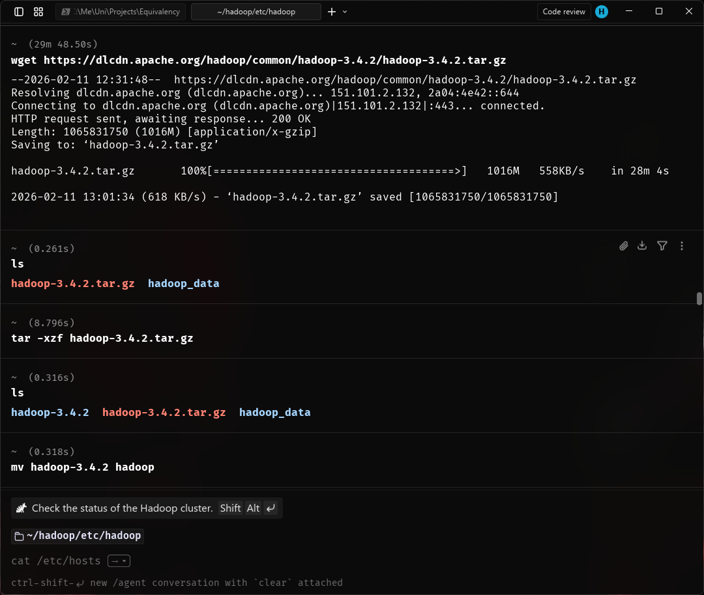
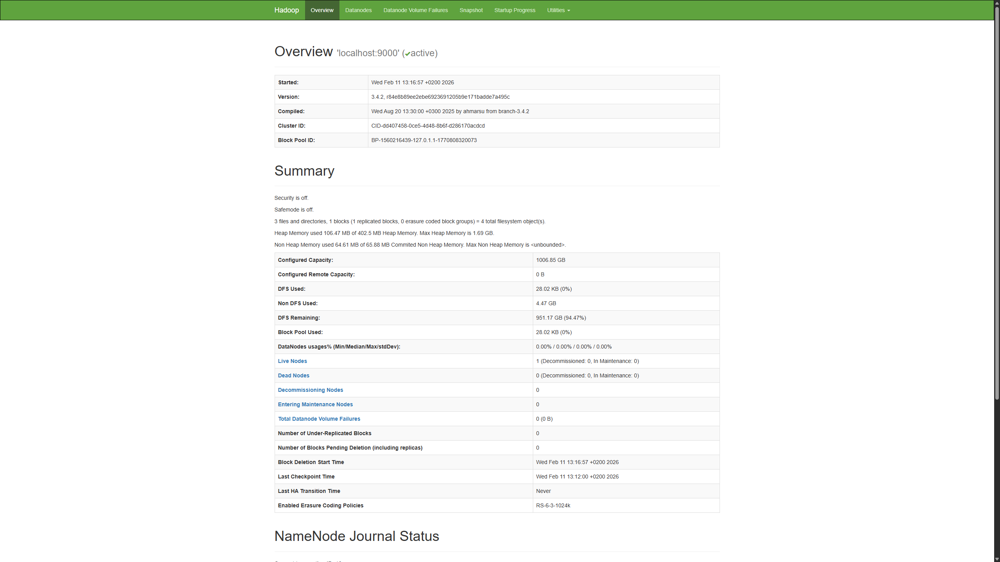
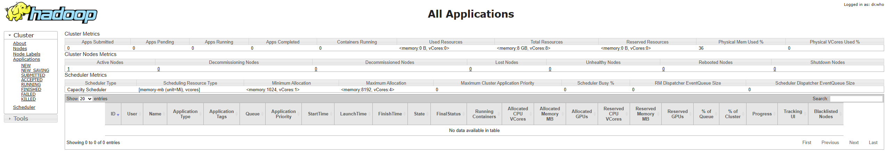
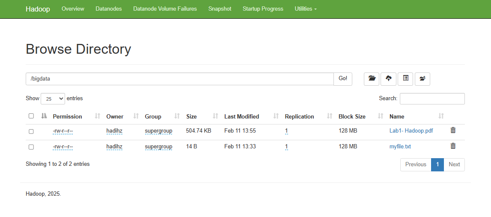

# IN411- Lab 1- Hadoop - HDFS

**Lab Report:**

- **Student:** Hadi Hijazi- 105174
- **Course:** IN411- Introduction to Big Data
- **Submitted to:** Dr. Mohammad Hamze

---

## Note on Environment

The lab instructions were designed for a native Windows setup. However, this lab was completed using **WSL (Windows Subsystem for Linux)** running **Ubuntu**, which provides a full Linux environment on Windows. All steps were adapted accordingly — replacing `.cmd` scripts with their Linux equivalents (`.sh` scripts), and using Linux-style paths and configuration. The end result is functionally identical: a fully working pseudo-distributed Hadoop cluster with HDFS operational and accessible via the same web GUIs.

Due to differences between WSL and native Windows, a few **extra configuration steps** were required and are clearly marked throughout this report.

---

## Objectives

- Install Java JDK 8
- Download and install Apache Hadoop 3.4.2
- Configure Hadoop for pseudo-distributed mode
- Format and start HDFS (NameNode + DataNode)
- Start YARN (ResourceManager + NodeManager)
- Create directories and upload files to HDFS
- Verify the setup via command-line and Web GUI

---

## Environment

| Component | Details |
| --- | --- |
| OS | Windows 11 with WSL2 (Ubuntu) |
| Java | OpenJDK 8 (`java-8-openjdk-amd64`) |
| Hadoop Version | 3.4.2 |
| Mode | Pseudo-distributed (single node) |
| HADOOP_HOME | `/home/hadihz/hadoop` |

---

## Step 1 - Install Java JDK 8

Java 8 is required by Hadoop. It was installed inside WSL using:

```bash
sudo apt-get install -y openjdk-8-jdk
```

Verify the installation:

```bash
java -version
# java version "1.8.0_482"
```

---

## Step 2 - Download and Extract Apache Hadoop

Hadoop 3.4.2 was downloaded directly inside WSL:

```bash
wget https://dlcdn.apache.org/hadoop/common/hadoop-3.4.2/hadoop-3.4.2.tar.gz
tar -xzf hadoop-3.4.2.tar.gz
mv hadoop-3.4.2 hadoop
```

> **Windows equivalent:** On native Windows, you would download the `.tar.gz` and extract it using WinRAR run as Administrator, then place the folder at a path like `C:\hadoop`.



---

## Step 3 - Set Environment Variables

Environment variables were added to `~/.bashrc`:

```bash
nano ~/.bashrc
```

The following lines were appended:

```bash
# Java
export JAVA_HOME=/usr/lib/jvm/java-8-openjdk-amd64
export PATH=$PATH:$JAVA_HOME/bin

# Hadoop
export HADOOP_HOME=/home/hadihz/hadoop
export PATH=$PATH:$HADOOP_HOME/bin:$HADOOP_HOME/sbin
export HADOOP_CONF_DIR=$HADOOP_HOME/etc/hadoop
```

Then reload:

```bash
source ~/.bashrc
```

### ⚙️ Extra Step (WSL only) — Set JAVA_HOME in hadoop-env.sh

On WSL, Hadoop starts its services through SSH, which opens a non-interactive shell that does **not** load `.bashrc`. This caused the following error when starting Hadoop:

```bash
ERROR: JAVA_HOME is not set and could not be found.
```

The fix was to set `JAVA_HOME` directly inside Hadoop's own environment file:

```bash
nano $HADOOP_HOME/etc/hadoop/hadoop-env.sh
```

Line added:

```bash
export JAVA_HOME=/usr/lib/jvm/java-8-openjdk-amd64
```

This ensures `JAVA_HOME` is always available regardless of how the process is launched.

---

## Step 4 - Create HDFS Data Directories

```bash
mkdir -p ~/hadoop_data/hdfs/namenode
mkdir -p ~/hadoop_data/hdfs/datanode
```

These directories store the NameNode metadata and DataNode data blocks respectively.

---

## Step 5 - Configure Hadoop XML Files

All configuration files are located in `$HADOOP_HOME/etc/hadoop/`.

### core-site.xml

Defines the default filesystem address:

```xml
<configuration>
    <property>
        <name>fs.defaultFS</name>
        <value>hdfs://localhost:9000</value>
    </property>
</configuration>
```

### hdfs-site.xml

Sets replication factor and storage paths:

```xml
<configuration>
    <property>
        <name>dfs.replication</name>
        <value>1</value>
    </property>
    <property>
        <name>dfs.namenode.name.dir</name>
        <value>file:///home/hadihz/hadoop_data/hdfs/namenode</value>
    </property>
    <property>
        <name>dfs.datanode.data.dir</name>
        <value>file:///home/hadihz/hadoop_data/hdfs/datanode</value>
    </property>
</configuration>
```

### mapred-site.xml

Specifies the MapReduce framework:

```xml
<configuration>
    <property>
        <name>mapreduce.framework.name</name>
        <value>yarn</value>
    </property>
</configuration>
```

> **Note:** In Hadoop 3.x, the file `mapred-site.xml.template` no longer exists. The file was created directly using `nano mapred-site.xml`.

### yarn-site.xml

Configures the NodeManager auxiliary service:

```xml
<configuration>
    <property>
        <name>yarn.nodemanager.aux-services</name>
        <value>mapreduce_shuffle</value>
    </property>
</configuration>
```

---

## Step 6 - Set Up Passwordless SSH

> **⚙️ Extra Step (WSL only)** — On native Windows, `start-dfs.cmd` launches services directly. On WSL, Hadoop uses SSH to start each service even on the same machine, simulating how it would connect to remote worker nodes in a real cluster.

OpenSSH was installed and configured for passwordless local access:

```bash
sudo apt-get install -y openssh-server
ssh-keygen -t rsa -P "" -f ~/.ssh/id_rsa
cat ~/.ssh/id_rsa.pub >> ~/.ssh/authorized_keys
chmod 600 ~/.ssh/authorized_keys
sudo service ssh start
ssh localhost   # tested successfully
```

Without this step, every `start-dfs.sh` call would fail with:

```bash
ssh: connect to host localhost port 22: Connection refused
```

---

## Step 7 - Format the NameNode

Before first use, the NameNode must be formatted (similar to formatting a disk). This initializes the HDFS metadata storage:

```bash
hdfs namenode -format
```

Key output confirming success:

```bash
Storage directory /home/hadihz/hadoop_data/hdfs/namenode has been successfully formatted.
```

> This command should only be run **once**. Running it again on an existing cluster would wipe all HDFS metadata and data.

---

## Step 8 - Start Hadoop Services

```bash
start-dfs.sh
start-yarn.sh
```

> **Windows equivalent:** `start-dfs.cmd` and `start-yarn.cmd` run as Administrator.

Verify all services are running:

```bash
jps
```

Expected output:

```bash
NameNode
DataNode
SecondaryNameNode
ResourceManager
NodeManager
```

---

## Step 9 - Create HDFS Directory and Upload a File

### Create a directory named `bigdata`

```bash
hadoop fs -mkdir /bigdata
hadoop fs -ls /
```

Output:

```bash
Found 1 items
drwxr-xr-x   - hadihz supergroup          0 2026-02-11 13:32 /bigdata
```

### Create and upload `myfile.txt`

```bash
echo "Hello Hadoop!" > myfile.txt
hadoop fs -put myfile.txt /bigdata
hadoop fs -ls -R /
```

Output:

```bash
drwxr-xr-x   - hadihz supergroup          0 2026-02-11 13:33 /bigdata
-rw-r--r--   1 hadihz supergroup         14 2026-02-11 13:33 /bigdata/myfile.txt
```

---

## Step 10 - HDFS Command Reference

| Command | Description |
| --- | --- |
| `hadoop fs -mkdir /path` | Create a directory in HDFS |
| `hadoop fs -ls /path` | List contents of an HDFS directory |
| `hadoop fs -ls -R /` | Recursively list all HDFS contents |
| `hadoop fs -put localfile /hdfs/path` | Upload a local file to HDFS |
| `hadoop fs -get /hdfs/path localfile` | Download a file from HDFS |
| `hadoop fs -cat /hdfs/path/file` | Print file contents from HDFS |
| `hadoop fs -rm /hdfs/path/file` | Delete a file from HDFS |
| `hadoop fs -rmdir /hdfs/path` | Delete an empty HDFS directory |
| `hadoop fs -mv /src /dest` | Move/rename a file in HDFS |
| `hadoop fs -cp /src /dest` | Copy a file within HDFS |
| `hadoop fs -du -h /path` | Show disk usage of HDFS path |
| `hdfs dfsadmin -report` | Show cluster health and DataNode status |

---

## Step 11 - Web GUI Access

Both web interfaces were accessed from the Windows browser while Hadoop ran inside WSL — the ports are automatically forwarded by WSL2.

### NameNode UI - <http://localhost:9870>

Displays the HDFS filesystem: live DataNodes, disk usage, replication status, and the ability to browse files and directories.



### ResourceManager UI - <http://localhost:8088>

Displays YARN cluster status: running applications, node health, and resource allocation.



---

## Extra Steps — WSL Web GUI Fixes

The web GUIs loaded correctly in the browser, but two issues were encountered specific to the WSL environment that required additional configuration.

### ⚙️ Fix 1 — File Download Failing (Hostname Resolution)

When attempting to download a file from the NameNode UI at `localhost:9870`, the browser was redirected to a URL using the machine's hostname (`105174-HIJAZI`) instead of `localhost`. Since this hostname is not resolvable from the Windows browser, the download failed.

**Root cause:** HDFS uses the system hostname to advertise the DataNode's address for data transfer. In WSL, this hostname resolves internally but not from the Windows-side browser.

**Fix:** The following properties were added to `hdfs-site.xml` to force `localhost` for all data transfer URLs:

```xml
<!-- Fix for WSL hostname resolution -->
<property>
    <name>dfs.datanode.hostname</name>
    <value>localhost</value>
</property>
<property>
    <name>dfs.client.use.datanode.hostname</name>
    <value>false</value>
</property>
```

After restarting HDFS (`stop-dfs.sh` then `start-dfs.sh`), file downloads from the UI worked correctly.

---

### ⚙️ Fix 2 — File Upload Failing (Permissions)

Uploading a file through the NameNode web UI failed silently. The issue was that the web UI performs uploads as a default system user called `dr.who`, which does not have write permissions on the HDFS directories owned by `hadihz`.

**Fix:** The following properties were added to configure the web UI to act as the correct user.

In `core-site.xml`:

```xml
<!-- Allow the web UI to act as the correct user -->
<property>
    <name>hadoop.http.staticuser.user</name>
    <value>hadihz</value>
</property>
<property>
    <name>hadoop.proxyuser.hadihz.hosts</name>
    <value>*</value>
</property>
<property>
    <name>hadoop.proxyuser.hadihz.groups</name>
    <value>*</value>
</property>
```

In `hdfs-site.xml`:

```xml
<!-- Enable WebHDFS for UI file operations -->
<property>
    <name>dfs.webhdfs.enabled</name>
    <value>true</value>
</property>
```

After restarting HDFS, both file upload and download from the web UI worked correctly.



---

## Conclusion

A fully functional pseudo-distributed Hadoop cluster was successfully set up inside WSL Ubuntu on Windows. All lab objectives were completed:

- Hadoop 3.4.2 was installed and configured
- HDFS was formatted and started (NameNode + DataNode)
- YARN was started (ResourceManager + NodeManager)
- A `/bigdata` directory was created in HDFS
- A file `myfile.txt` was uploaded and verified in HDFS
- Both web GUIs are accessible at `localhost:9870` and `localhost:8088`

The WSL approach offers an advantage over native Windows setup: it provides a true Linux environment which is the native platform for Hadoop, avoiding many Windows-specific compatibility issues. The few extra steps required — SSH setup, `JAVA_HOME` in `hadoop-env.sh`, and hostname/permissions fixes for the web UI — are well-documented and straightforward to resolve.
