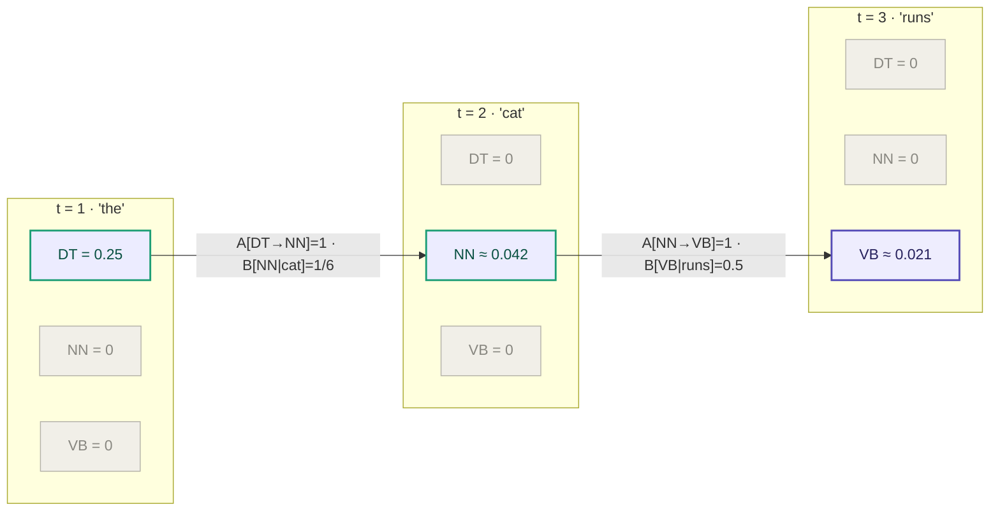
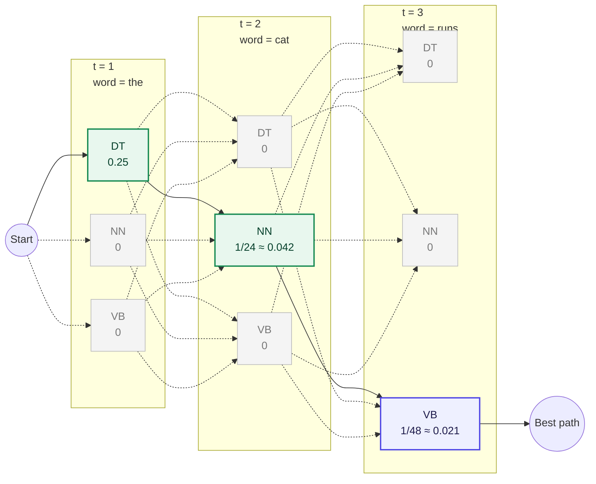

# POS Tagging with Hidden Markov Models

Given the HMM you computed in Part 1, use the Viterbi algorithm to find the most likely tag sequence for the following sentence:

$$
\text{the cat runs}
$$

## Solution

### Part 1

1. As we can see from the corpus, the possible tags are NN, VB, and DT, so:
**States (Q)**: $Q = \{NN, VB, DT\}$

2. All unique words in the corpus form the following vocabulary
**Vocabulary (V)**: $V = \{\text{the}, \text{dog}, \text{runs}, \text{lion}, \text{is}, \text{an}, \text{animal}, \text{cat}\}$

3. **Prior Probabilities ($\pi$)**:
   - $\pi(DT) = 0.5$*, since 2 out of 4 sentences start with a determiner (the).*
   - $\pi(NN) = 0.5$*, since 2 out of 4 sentences start with a noun.*
   - $\pi(VB) = 0.0$*, since no sentence starts with a verb.*

4. **Transition Matrix (A)**:

| From \ To | NN | VB | DT |
|-----------|----|----|-----|
| **DT** | 4/4 = 1 | 0 | 0 |
| **NN** | 0 | 4/4 = 1 | 0 |
| **VB** | 0 | 0 | 2/2 = 1 |

5. **Emission Matrix (B)**:

| Tag \ Word | the | dog | runs | lion | is | an | animal | cat |
|------------|-----|-----|------|------|----|----|--------|-----|
| **DT** | 2/4 = 0.5 | 0 | 0 | 0 | 0 | 2/4 = 0.5 | 0 | 0 |
| **NN** | 0 | 2/6 = 1/3 | 0 | 1/6 | 0 | 0 | 2/6 = 1/3 | 1/6 |
| **VB** | 0 | 0 | 2/4 = 0.5 | 0 | 2/4 = 0.5 | 0 | 0 | 0 |

### Part 2

We apply the **Viterbi algorithm** to find the most likely tag sequence for: **"the cat runs"**

#### Diagram

#### Step-by-Step Computation

**Initialization** $(t = 1,\ \text{word} = \text{"the"})$:

$$v(DT, 1) = \pi(DT) \times B[DT \mid \text{the}] = 0.5 \times 0.5 = \mathbf{0.25}$$
$$v(NN, 1) = \pi(NN) \times B[NN \mid \text{the}] = 0.5 \times 0 = 0$$
$$v(VB, 1) = \pi(VB) \times B[VB \mid \text{the}] = 0 \times 0 = 0$$

**Recursion** $(t = 2,\ \text{word} = \text{"cat"})$:

$$v(DT, 2) = 0 \quad \because B[DT \mid \text{cat}] = 0$$
$$v(NN, 2) = v(DT,1) \times A[DT \to NN] \times B[NN \mid \text{cat}] = 0.25 \times 1 \times \tfrac{1}{6} = \mathbf{\tfrac{1}{24} \approx 0.042}$$
$$v(VB, 2) = 0 \quad \because B[VB \mid \text{cat}] = 0$$

**Recursion** $(t = 3,\ \text{word} = \text{"runs"})$:

$$v(DT, 3) = 0 \quad \because B[DT \mid \text{runs}] = 0$$
$$v(NN, 3) = 0 \quad \because B[NN \mid \text{runs}] = 0$$
$$v(VB, 3) = v(NN,2) \times A[NN \to VB] \times B[VB \mid \text{runs}] = \tfrac{1}{24} \times 1 \times 0.5 = \mathbf{\tfrac{1}{48} \approx 0.021}$$

**Backtracking**:

| $t$ | Winning state | Came from |
|-----|--------------|-----------|
| 3   | VB           | NN        |
| 2   | NN           | DT        |
| 1   | DT           | —         |

#### Result

$$\boxed{\text{the}/DT \quad \text{cat}/NN \quad \text{runs}/VB}$$